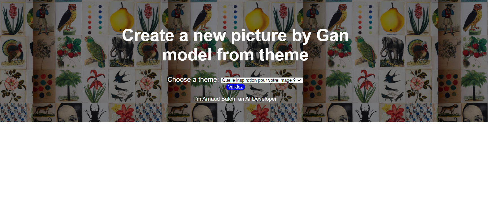
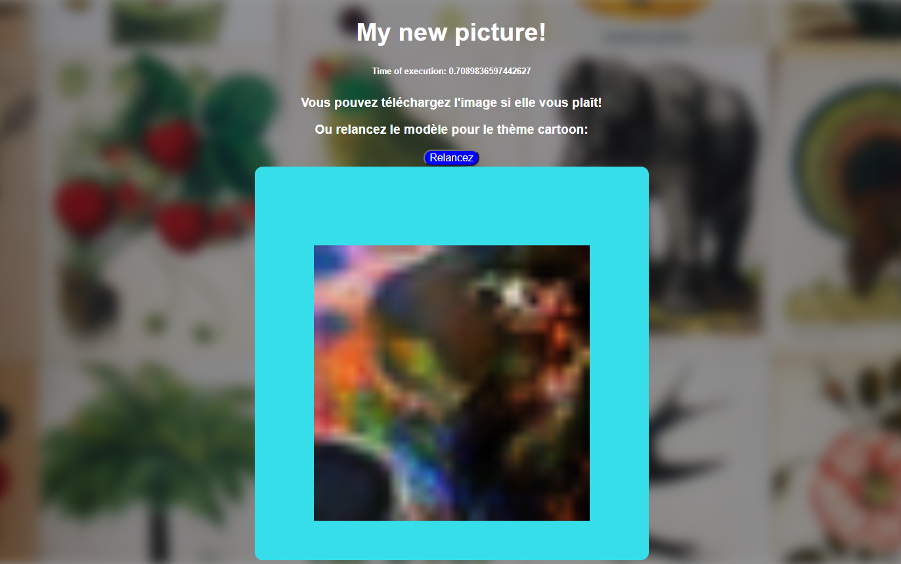
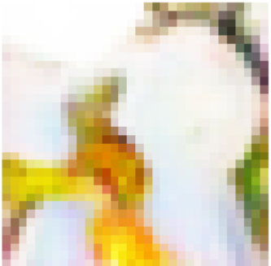

# projetDCGAN
Create new images of characters from 5 themes (cartoons, heroic-fantasy, intergalactic saga, heroes, video gaming).
Each theme have a dataset of 2000 images before data augmentation. 
After dowloaded folders, you can launch the web app (Flask) by "python app.py" in your folder path in command line.
The model is stored in mongoDB, you need to install Pymongo and a create a database...  
PHOTOGRAPHY BY STEPHEN KENT JOHNSON; WALLPAPER FROM THE JOHN DERIAN PICTURE BOOK
Some results:

